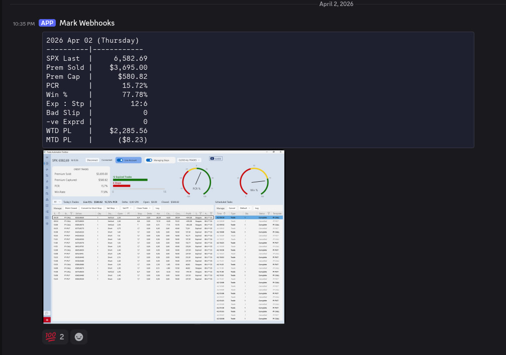

# TradeScout

**TradeScout** is a tool that integrates with trades from [Trade Automation Toolbox (TAT)](https://tradeautomationtoolbox.com/). It provides detailed analytics and metrics to track trade performance based on various parameters and outputs summaries to a configured Discord channel using webhooks.

## Features

TradeScout computes multiple metrics for each trade, including:

- **SPX Last**: The last recorded value of the SPX index for the day.
- **Premium Sold**: Total premium sold from all trades.
- **Premium Captured**: Total premium captured from all trades (profits/losses).
- **PCR (Premium Capture Rate)**: Percentage of premium captured relative to the total premium sold.
- **Win %**: The percentage of profitable trades.
- **Expired Trades**: Number of trades that expired worthless.
- **Stopped Trades**: Number of trades that were closed due to hitting their stop target.
- **Bad Slip**: Number of trades where slippage exceeded $0.50, with the maximum shown.
- **Negative Expired**: Number of trades that expired with a negative profit.
- **WTD PL (Week-to-Date Profit/Loss)**: Total premium captured from the most recent Monday to the current day.
- **MTD PL (Month-to-Date Profit/Loss)**: Total premium captured from the first day of the current month to the current day.

## Download

Pre-built Windows binaries are available on the [Releases](../../releases) page. Download `TradeScout.7z`, extract it, and follow the configuration steps below.

## Configuration

Copy `config/config.demo.yaml` to `config/config.yaml` next to `TradeScout.exe` and fill in your values:

```yaml
# Path to your TAT database file (use forward slashes even on Windows)
db_path: "../data.db3"

webhooks:
  - url: "https://discord.com/api/webhooks/WEBHOOK_ID"
    thread_id: "THREAD_ID"   # optional: targets a specific thread
  - url: "https://discord.com/api/webhooks/ANOTHER_WEBHOOK"
    thread_id: null           # omit to post to the main channel
```

**db_path** — find `data.db3` inside TAT's `LocalState` folder, e.g.:
`C:\Users\<you>\AppData\Local\Packages\TradeAutomationToolbox_...\LocalState\`

## Usage

```
TradeScout.exe                    # today's trades, maximize window, with screenshot
TradeScout.exe --date 20260402    # specific date (YYYYMMDD)
TradeScout.exe --noimage          # skip screenshot
TradeScout.exe --win restore      # restore window instead of maximizing
TradeScout.exe --debug            # print to console, don't post to Discord
```

After posting, TradeScout will ask for 30 seconds whether you want to delete the message.

## Example Output

```
2026 Apr 02 (Thursday)
----------|------------
SPX Last  |     6,582.69
Prem Sold |    $3,695.00
Prem Cap  |      $580.82
PCR       |       15.72%
Win %     |       77.78%
Exp : Stp |         12:6
Bad Slip  |            0
-ve Exprd |            0
WTD PL    |    $2,285.56
MTD PL    |      ($8.23)
```



---

## How to Compile Under Windows

### Prerequisites

- **Python 3.11** — download from [python.org](https://www.python.org/downloads/release/python-3119/). Check **"Add Python to PATH"** during install.
- **7-Zip** — download from [7-zip.org](https://www.7-zip.org/) (needed to create the release archive).

### Steps

```powershell
# 1. Clone the repository
git clone https://github.com/breyer/TradeScout
cd TradeScout

# 2. Install dependencies
pip install -r requirements.txt
pip install pyinstaller

# 3. Build the executable
pyinstaller --onefile --name TradeScout `
  --hidden-import pyscreeze `
  --hidden-import PIL `
  --hidden-import PIL.Image `
  Trade_Scout.py

# 4. Package for distribution
mkdir release
copy dist\TradeScout.exe release\
copy config\config.demo.yaml release\config.demo.yaml
"& 'C:\Program Files\7-Zip\7z.exe' a TradeScout.7z .\release\*"

# The compiled EXE is at:  dist\TradeScout.exe
# The release archive is:  TradeScout.7z
```

> **Note:** PyInstaller must be run on Windows to produce a Windows EXE — cross-compilation is not supported.

### Directory Layout After Build

```
TradeScout.exe
config\
  config.yaml        ← copy from config.demo.yaml and fill in
```
